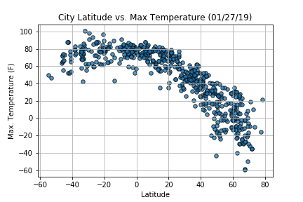
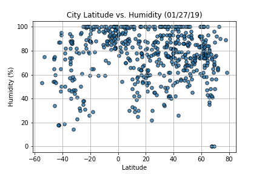
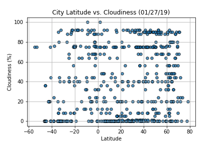
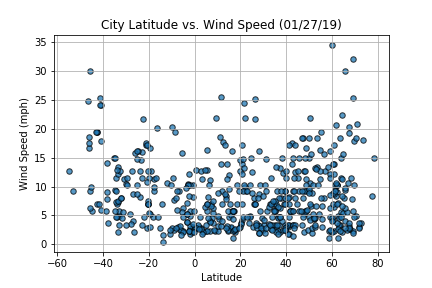

# Using APIs

## Background

"What's the weather like as we approach the equator?" Create a Python script to visualize the weather of 500+ cities across the world of varying distance from the equator using the [CityPy Python Library](https://pypi.python.org/pypi/citipy), and the [OpenWeatherMap API](https://openweathermap.org/api).

Build a series of Scatter Plots to showcase the following relationships:

#### Temperature (F) vs. Latitude

#### Humidity (%) vs. Latitude

#### Cloudiness (%) vs. Latitude

#### Wind Speed (mph) vs. Latitude

Your final notebook must:

* Randomly select **at least** 500 unique (non-repeat) cities based on latitude and longitude.
* Perform a weather check on each of the cities using a series of successive API calls.
* Include a print log of each city as it's being processed with the city number and city name.
* Save both a CSV of all data retrieved and png images for each scatter plot.

## Considerations

* The city data is generated based on random coordinates; as such, the outputs will not be an exact match each time the code is run
* Next, spend the requisite time necessary to study the OpenWeatherMap API. Based on your initial study, you should be able to answer basic questions about the API: Where do you request the API key? Which Weather API in particular will you need? What URL endpoints does it expect? What JSON structure does it respond with? Before a line of code is written, you should be aiming to have a crystal clear understanding of your intended outcome
* In building the script, pay attention to the cities that are used in the query pool. Are you getting coverage of the full gamut of latitudes and longitudes? Or are you simply choosing 500 cities concentrated in one region of the world? Simply rattling 500 cities based on your human selection would create a biased dataset. Be thinking of how this should be countered. (Hint: Consider the full range of latitudes).

## Observable Trends

* As expected, the weather becomes significantly warmer as one approaches the equator (0 Deg. Latitude). More interestingly, however, is the fact that the southern hemisphere tends to be warmer this time of year than the northern hemisphere. This may be due to the tilt of the earth, or more obviously - it is currently summer in the southern hemisphere.
* There is no strong relationship between latitude and cloudiness. However, it is interesting to see that a strong band of cities sits at 0, 80, and 100% cloudiness.
* There is no strong relationship between latitude and wind speed. However, in northern hemispheres there is a flurry of cities with over 20 mph of wind.
